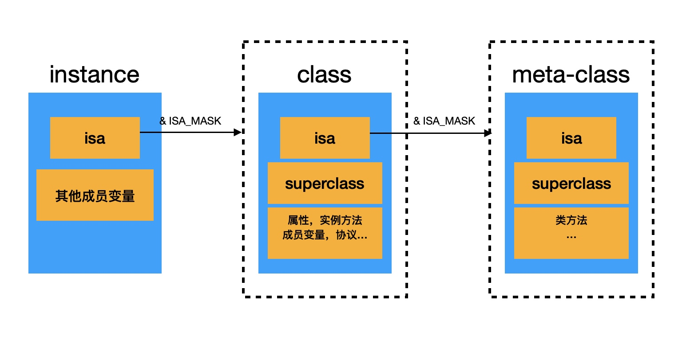
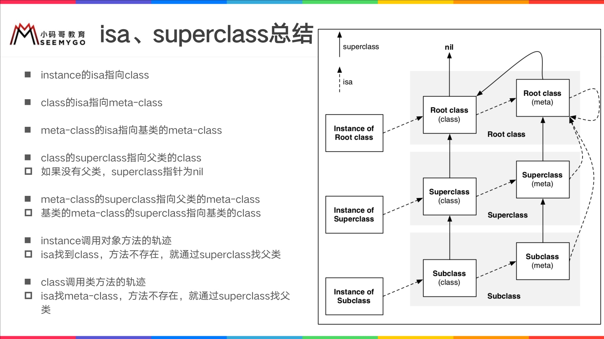
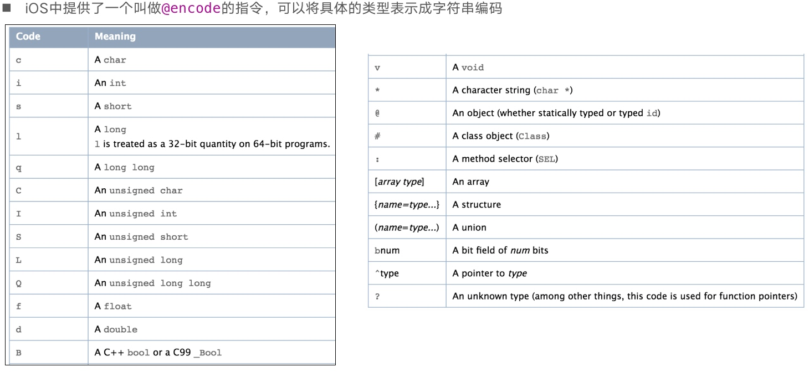
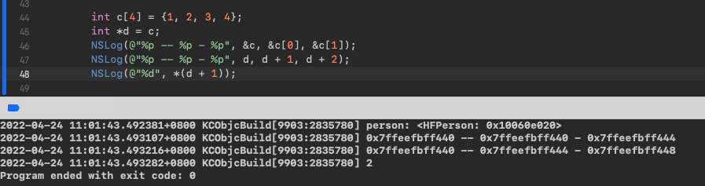
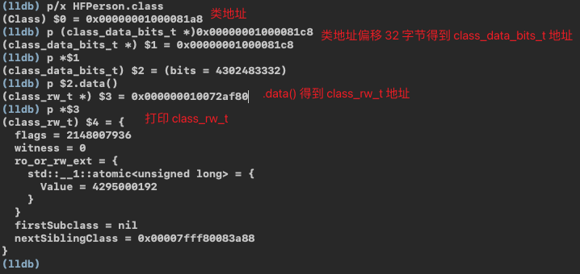
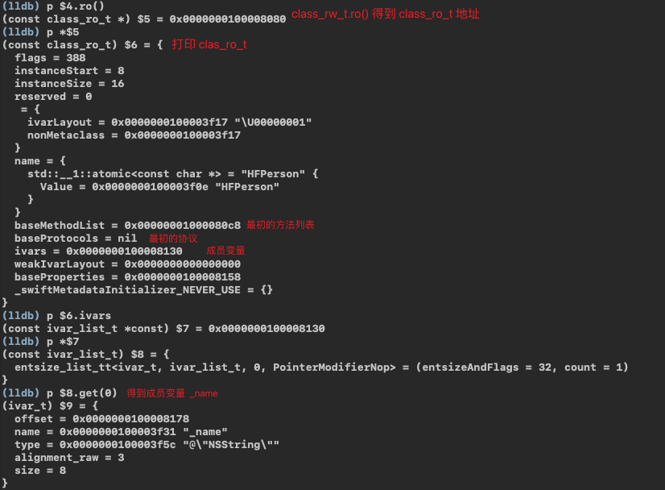

# 类
> 前面通过**OC - 对象**我们得知，在**对象**的初始化过程中建立了与其**class**的联系，下面就是关于**类**的分析

### Overview



### 底层结构

定义一个 HFPerson 类
```objc
@interface HFPerson : NSObject
@property (nonatomic, copy) NSString *name;

- (void)sayHello;
@end

@implementation HFPerson
- (void)sayHello {
    NSLog(@"HFPerson -sayHello");
}
@end
```
#### objc_class
```c++
struct objc_class : objc_object {
    Class isa;
    Class superclass;
    
    cache_t cache;
    class_data_bits_t bits;
}
```

#### class_rw_t 结构
存放类中的`属性`、`方法`和`遵循的协议`等信息
```c++
struct class_rw_t {
    uint32_t flags;
    uint32_t version;
    
    const class_ro_t *ro; 
    /*
     这三个都是二维数组，是可读可写的，包含了类的初始内容、分类的内容。
     其中 method_array_t 存放类似这种结构：[method_list_t<method_t>,
                                        method_list_t<method_t>,
                                        method_list_t<method_t>]
     */
    method_array_t methods; // 方法列表（类对象存放对象方法，元类对象存放类方法）
    property_array_t properties; // 属性列表
    protocol_array_t protocols; //协议列表
}
```

##### method_t 结构
```c++
struct method_t {
    SEL name; // 函数名
    const char *types; // type encoding 编码(返回类型，参数类型)
    IMP imp; // 函数地址
}
```
`SEL`: </br>
方法/函数名，一般叫选择器，底层结构类似`char *`，可以通过`@selector()`和`sel_registerName()`获得，不同类中的相同名字的方法，所对应的方法选择器是相同的</br>

`types`: </br>
比如声明一个`-(void)test;`方法，对应的types大概是`v16@0:8`,其中16表示所有参数占用的空间大小，后面的0，8表示参数起始位置。`@`和`:`是两个默认的参数`(id)self`和`(SEL)_cmd`，可通过`@encode(type-name)`验证

`IMP`: </br>
函数的地址，代表函数的具体实现</br>
`typedef id _Nullable (*IMP)(id _Nonnull, SEL _Nonnull, ...);`

##### Type Encoding


#### class_ro_t 结构
存放类的初始信息
```c++
struct class_ro_t {
    uint32_t flags;
    uint32_t instanceStart;
    uint32_t instanceSize;
    uint32_t reserved;

    const uint8_t * ivarLayout;

    const char * name;
    /* 这三个都是一维数组 */
    method_list_t * baseMethodList; // 初始方法，存放method_t类型的数据
    protocol_list_t * baseProtocols; // 初始协议
    const ivar_list_t * ivars; // 成员变量

    const uint8_t * weakIvarLayout;
    property_list_t *baseProperties;
}
```

### 验证
#### 内存偏移


`&c`，`&c[0]`和`d` 都是取的**数组首地址**<br>
`d + 1`是以**该数组的内部数据类型所占的内存大小为单位，偏移 1 个单位**

#### 验证 class_rw_t
```c
struct objc_class : objc_object {
    ...
    class_rw_t *data() const {
        return bits.data();
    }
}
```


#### 验证 class_ro_t
```c
struct class_rw_t {
    ...
    const class_ro_t *ro() const {
        auto v = get_ro_or_rwe();
        if (slowpath(v.is<class_rw_ext_t *>())) {
            return v.get<class_rw_ext_t *>(&ro_or_rw_ext)->ro;
        }
        return v.get<const class_ro_t *>(&ro_or_rw_ext);
    }
}
```


### 缓存`cache_t cache`
#### 数据结构
在`objc_class`内部有个结构体`cache_t`，里面就缓存着曾用过的方法</br>
```c++
// 看到这种结构就该联想到 散列表
struct cache_t {
    struct bucket_t *_buckets; // 散列表, [...bucket_t、bucket_t、bucket_t...]
    mask_t _mask; // _mask = _buckets.length - 1
    mask_t _occupied; // 已缓存的方法数量
}

struct bucket_t {
    SEL _key;
    IMP _imp;
}
```

#### 存储的形式
`散列表(哈希表)` 的方式存储，以空间换时间

#### 表格大概如下
| 索引i  | bucket_t                                   |
|-----|----------------------------------------|
| 0   | NULL                                   |
| 1   | NULL                                   |
| 2   | bucket_t(_key = @selector(test), _imp) |
| 3   | NULL                                   |
| 4   | NULL                                   |
| ... | ...                                    |

#### 原理
例如: `[objc test]`

##### 散列表 取值过程：
1. 调动方法`@selector(test)`
2. 用传入的`SEL`和`_mask`按位与`&`得到索引`i`
3. 根据索引`i`找到`bucket_t`，判断其中的`SEL`与传入的`SEL`是否相同
    1. 是，返回该`SEL`对应的`_iml`
    2. 否，检查索引`i-1`，继续比较`SEL`，以此类推，如果索引<0，则使索引=_mask-1，直到找到`_imp`


##### 散列表 存值过程：
1. 调用方法`@selector(test)`
2. 初始时，为对象的`cache_t`分配一定的空间，`cache_t`下的`_mask`值为`散列表`的长度 - 1
3. 用传入的`SEL`和`_mask`按位与`&`得到索引`i`(这样得到的`i`也一定小于 <= `_mask`)
4. 检查索引`i`对应的空间是否为`NULL`
    1. 是，将这个`bucket_t(@selector(test), _imp`缓存在索引`i`对应的空间
    2. 否，检查索引`i-1`对应的空间是否为`NULL`，以此类推，如果索引<0，则使索引=_mask-1，并检查对应的空间是否为`NULL`，直到找到索引空间为`NULL`的再缓存


### class方法，object_getClass 和 objc_getClass 三者的区别
####  `class`方法

`class`方法无论是类对象还是实例对象都可以调用，可以嵌套，返回永远是自身的类对象。如：
```swift
Person *p = [[Person alloc]init];
Class *pClass == [p class] == [ [p class]class] == [[ [p class]class]class] == [Person class]
```

####  `object_getClass`方法

`object_getClass`和`class`同样可以嵌套，但是`object_getClass`得到的是他的 isa 指向的地址。如：
```swift
Person *p = [[Person alloc] init];     
p -> [Person class] -> PersonMetaClass -> RootMetaClass -> RootMetaClass
// 意思是： p 的 isa 指向 [Person class] , [Person class] 的 isa 指向 PersonMetaClass, PersonMetaClass应该指向基类的metaClass，基类metaClass指向他自己
```

####  `objc_getClass`方法

`objc_getClass`无法嵌套，因为参数 是`char`类型，效果和`class`相同(因为不能嵌套，所以和`class`可以认为是相同的)