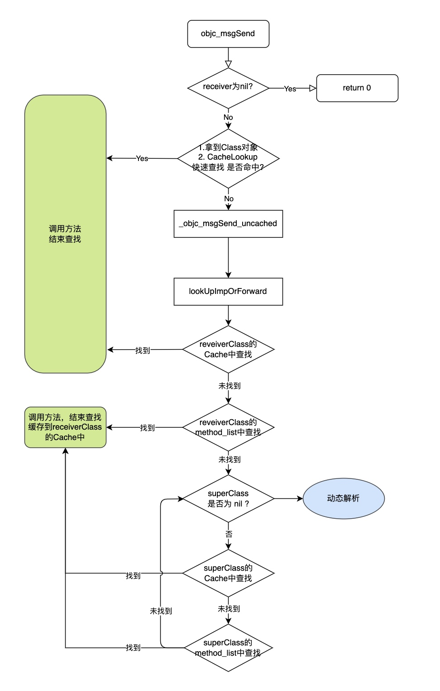
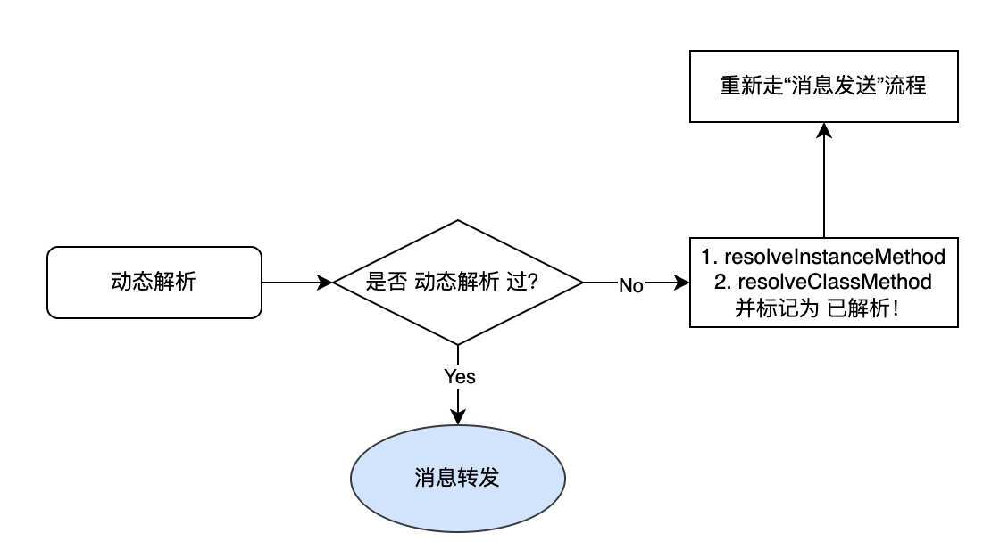
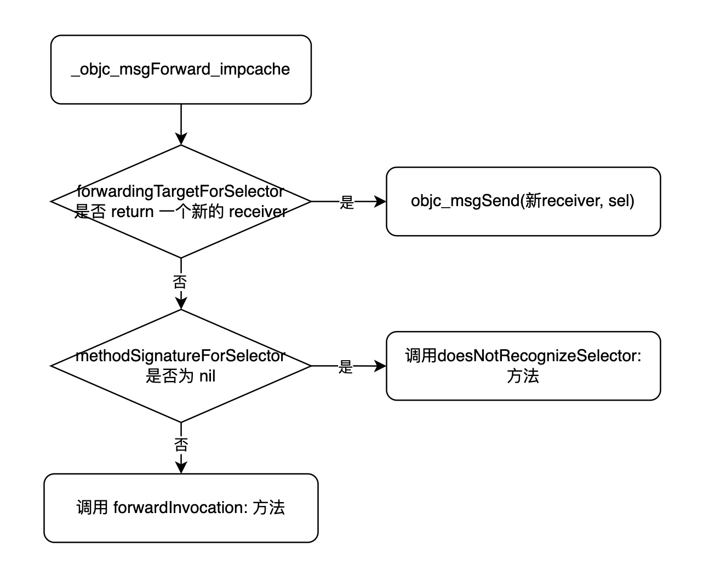

# OC 消息(objc_msgSend)

### 基本介绍
一条消息的发送可以分为以下三个流程
1. 消息发送
2. 动态解析
3. 消息转发

### 执行流程
#### 消息发送
</br>
* 从`method_list`中查找，根据是否排序分为`二分查找`和`遍历查找`
* 把方法缓存到`objc_class`中的`Cache`的方式和之前将的`方法缓存`逻辑一致

#### 动态解析
</br>
两种实现方式：</br>
* 第一种
```c
void other(id self, SEL _cmd) {
    NSLog(@"%@, _cmd: %s", self, sel_getName(_cmd));
}

+ (BOOL)resolveInstanceMethod:(SEL)sel {
    if (sel == @selector(test)) {
        class_addMethod(self, sel, (IMP)other, "v@:");
        return YES;
    }
    return [super resolveInstanceMethod:sel];
}
```
* 第二种
```objc
- (void)other {
    NSLog(@"%s", __func__);
}

+ (BOOL)resolveInstanceMethod:(SEL)sel {
    if (sel == @selector(test)) {
        Method method = class_getInstanceMethod(self, @selector(other));
        class_addMethod(self,
                        sel,
                        method_getImplementation(method),
                        method_getTypeEncoding(method));
        return YES;
    }
    return [super resolveInstanceMethod:sel];
}
```

#### 消息转发
</br>
以下方法都有`实例方法`和`类方法`两个版本，不过`Xcode`无法自动补全`类方法`，导致很多人误以为只有`实例方法`。
```objc
- (id)forwardingTargetForSelector:(SEL)aSelector {
    if (aSelector == @selector(sel)) {
        // 给 return 的对象发送 objc_msgSend(otherObj, sel);
        return [OtherClass new];
    }
    return [super forwardingTargetForSelector:aSelector];
}

- (NSMethodSignature *)methodSignatureForSelector:(SEL)aSelector {
    if (aSelector == @selector(sel)) {
        return [NSMethodSignature signatureWithObjCTypes: "v@:"];
    }
    return [super methodSignatureForSelector:aSelector];
}

// anInvocation 是由上面 methodSignatureForSelector 返回的 signature 初始化的
- (void)forwardInvocation:(NSInvocation *)anInvocation {
    // 这里可以随意发挥
}
```


### 听课笔记
1. runtime源码基本由 c, c++, 汇编 实现
2. 频繁调用的函数基本由`汇编`实现，如 `objc_msgSend`
3. 二分查找
4. 给 nil 发送消息，给 null 发送消息
5. methodSignature中的签名格式决定了后续`forwardInvocation`的 NSInvocation `参数`和`返回值`
6. `synthesize`: 
7. `dynamic`: 提醒编译器不要自动生成`setter`和`getter`的实现，不要生成成员变量