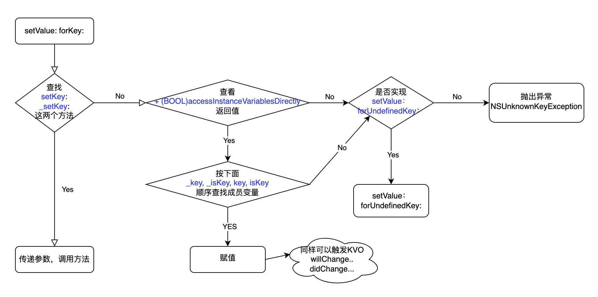
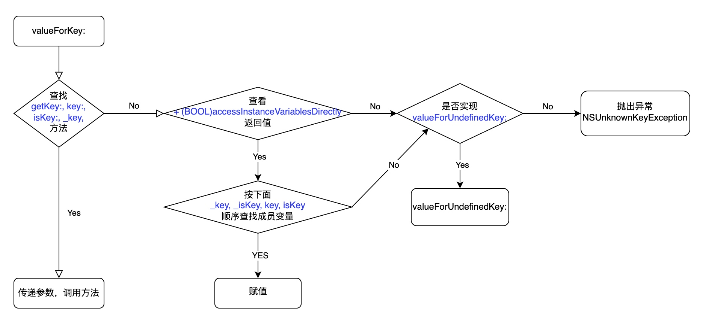

# KVC
> 全称是Key-Value Coding，俗称“键值编码”，可以通过一个`key`来访问某个属性
> KVC是通过`NSObject`的一个分类`NSKeyValueCoding`来实现的
### 四个函数
* -(void)setValue:(id)value forKeyPath:(NSString *)keyPath;
* -(id)valueForKeyPath:(NSString *)keyPath;

* -(void)setValue:(id)value forKey:(NSString *)key;
* -(id)valueForKey:(NSString *)key; 
### keyPath
对于一些类的成员变量有可能是自定义类或其他的复杂数据类型，KVC提供了一个解决方案，那就是键路径`keyPath`
```objc
@interface HFPerson()
@property (nonatomic, copy) NSString* name;
@property (nonatomic, strong) Address* address;
@end

@interface Address()
@property (nonatomic, copy) NSString* country;
@end

- (void)viewDidLoad {
    [super viewDidLoad];
    [self.person setValue:@"Beijing..." forKeyPath:@"address.country"]; 
}
```

### 原理
#### 赋值



#### 取值


### 应用
#### 1. 动态地取值和设值
#### 2. 用KVC来访问和修改私有变量
#### 3. 修改一些控件的内部属性
众所周知很多UI控件都由很多内部UI控件组合而成的，但是Apple度没有提供这访问这些控件的API，这样我们就无法正常地访问和修改这些控件的样式。而KVC在大多数情况可下可以解决这个问题。最常用的就是个性化UITextField中的placeHolderText了。下面演示如果修改placeHolder的文字样式：
```swift
let count:UnsafeMutablePointer<UInt32> =  UnsafeMutablePointer<UInt32>()
var properties = class_copyIvarList(UITextField.self, count)
while properties.memory.debugDescription !=  "0x0000000000000000"{
    let t = ivar_getName(properties.memory)
    let n = NSString(CString: t, encoding: NSUTF8StringEncoding)
    print(n)                 // 打印出所有属性
    properties = properties.successor()
}

...
Optional(_disabledBackgroundView)
Optional(_systemBackgroundView)
Optional(_floatingContentView)
Optional(_contentBackdropView)
Optional(_fieldEditorBackgroundView)
Optional(_fieldEditorEffectView)
Optional(_displayLabel)
Optional(_placeholderLabel) // 这个正是要修改的属性
Optional(_dictationLabel)
Optional(_suffixLabel)
Optional(_prefixLabel)
Optional(_iconView)
```
#### 4. 操作集合
因为NSString本来就有capitalizedString属性，举一反三，NSString其他的属性也可以做响应的操作
```objc
NSArray* arrStr = @[@"english",@"franch",@"chinese"];
NSArray* arrCapStr = [arrStr valueForKey:@"capitalizedString"];
for (NSString* str  in arrCapStr) {
    NSLog(@"%@",str);
}
NSArray* arrCapStrLength = [arrStr valueForKeyPath:@"capitalizedString.length"];
for (NSNumber* length  in arrCapStrLength) {
    NSLog(@"%ld",(long)length.integerValue);
}
打印结果
2016-04-20 16:29:14.239 KVCDemo[1356:118667] English
2016-04-20 16:29:14.240 KVCDemo[1356:118667] Franch
2016-04-20 16:29:14.240 KVCDemo[1356:118667] Chinese
2016-04-20 16:29:14.240 KVCDemo[1356:118667] 7
2016-04-20 16:29:14.241 KVCDemo[1356:118667] 6
2016-04-20 16:29:14.241 KVCDemo[1356:118667] 7
```
### 面试
#### 通过KVC修改 属性 是否可以触发 KV0？
可以

#### 直接修改 成员变量 是否会触发 KVO？
不会。</br>
但是如果通过 KVC 修改成员变量的值，是可以触发 KVO 的</br>
伪代码如下：
```objc
[self.person setValue:@10 forKey:@"age"];
==>
{
    [self.person willChangeValueForKey:@"age"];
    self.person->_age = 10;
    [self.person didChangeValueForKey:@"age"]; // 因为didChangeValueForKey方法会手动触发 KVC 的 observeValueForKeyPath...
}
```