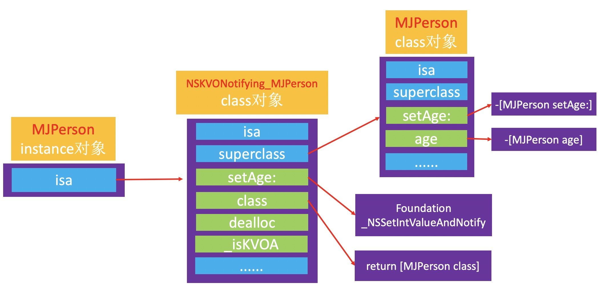

# KVO

> KVO的全称是Key-Value Observing，俗称“键值监听”，可以用于监听某个对象属性值的改变.

### 介绍：
```objc
@interface KVOPerson : NSObject
@property (nonatomic, copy) NSString *name;
@end

@interface KVOViewController ()
@property (nonatomic, strong) KVOPerson *person;
@end

@implementation KVOViewController
- (void)viewDidLoad {
    [super viewDidLoad];
    
    self.person = [KVOPerson new];
    self.person.name = @"张三";
    
    // 为什么加了这行代码，“self”就能监控person的name值变化？
    // 看起来像是给person加了个代理来监控name的setter方法
    [self.person addObserver:self forKeyPath:@"name" options:NSKeyValueObservingOptionOld | NSKeyValueObservingOptionNew context:nil];
}

- (void)dealloc {
    [self.person removeObserver:self forKeyPath:@"name"];
}

- (void)touchesBegan:(NSSet<UITouch *> *)touches withEvent:(UIEvent *)event {
    self.person.name = @"李四";
}

- (void)observeValueForKeyPath:(NSString *)keyPath ofObject:(id)object change:(NSDictionary<NSKeyValueChangeKey,id> *)change context:(void *)context {
    HFLog(@"监听到%@的属性值%@发生改变 - %@", object, keyPath, change);
}
@end
```

### 原理：
当观察类A的实例对象时，利用`Runtime API`动态创建一个名为`NSKVONotifying_A`的中间类，并继承自A类，
被观察的实例对象的isa指向中间类`NSKVONotifying_A`，并且重写观察属性`p`的`Setter`方法，大概流程如下：

#### 1. 动态生成 NSKVONotifying_A
```
[被观察对象 addObserver:观察者 forKeyPath:被观察属性 options:待观察的内容 context:附带的参数];
```
#### 2. 重写 Setter 方法，伪代码如下:
```
- (void)setP:(int)p {
    _NSSetIntValueAndNotify();
}
```

#### 3. 因为上面的属性p是int，所以这里是 _NSSetIntValueAndNotify()
```
(void) _NSSetIntValueAndNotify() {
    [self willChangeValueForKey: @"p"];
    [super setP: p];
    [self didChangeValueForKey: @"p"];
}
```

#### 4. didChangeValueForKey: 
```
内部会调用 observer 的 observeValueForKeyPath:ofObject:change:context: 方法
```



### 验证
#### object_getClass，打印isa指向的对象
```objc
HFLog(@"KVO之前: %@", object_getClass(self.person));
[self.person addObserver:self forKeyPath:@"name" options:NSKeyValueObservingOptionOld | NSKeyValueObservingOptionNew context:nil];
HFLog(@"KVO之后: %@", object_getClass(self.person));

打印:
[15:59:26] -[KVOViewController viewDidLoad] [第24行]👉 KVO之前: KVOPerson
[15:59:26] -[KVOViewController viewDidLoad] [第26行]👉 KVO之后: NSKVONotifying_KVOPerson
```

#### IMP，查看setter方法的地址
```objc
HFLog(@"KVO之前: %p", [self.person methodForSelector:@selector(setName:)]);
[self.person addObserver:self forKeyPath:@"name" options:NSKeyValueObservingOptionOld | NSKeyValueObservingOptionNew context:nil];
HFLog(@"KVO之前: %p", [self.person methodForSelector:@selector(setName:)]);

打印
[16:09:38] -[KVOViewController testIMP] [第34行]👉 KVO之前: 0x102a3d190
[16:09:38] -[KVOViewController testIMP] [第36行]👉 KVO之前: 0x103a52203
(lldb) p (IMP)0x102a3d190
(IMP) $0 = 0x0000000102a3d190 (Interview-iOS`-[KVOPerson setName:] at KVOPerson.h:13)
(lldb) p (IMP)0x103a52203
(IMP) $1 = 0x0000000103a52203 (Foundation`_NSSetObjectValueAndNotify) // 添加KVO监控后，setter方法的实现已经不在原来的位置了
(lldb) 
```

#### 中间类的方法列表
```objc
- (void)touchesBegan:(NSSet<UITouch *> *)touches withEvent:(UIEvent *)event {
    unsigned int count;
    Method *methods = class_copyMethodList(object_getClass(self.person), &count);
    for (int i = 0; i < count; i++) {
        Method method = methods[i];
        SEL selector = method_getName(method);
        NSString *name = NSStringFromSelector(selector);
        HFLog(@"method_getName:%@",name);
    }
    self.person.name = @"李四";
}

打印
[17:04:15] -[KVOViewController touchesBegan:withEvent:] [第50行]👉 method_getName:setName:
[17:04:15] -[KVOViewController touchesBegan:withEvent:] [第50行]👉 method_getName:class
[17:04:15] -[KVOViewController touchesBegan:withEvent:] [第50行]👉 method_getName:dealloc
[17:04:15] -[KVOViewController touchesBegan:withEvent:] [第50行]👉 method_getName:_isKVOA
```

### 中间类的结构
```objc
@implementation NSKVONotifying_KVOPerson
void _NSSetObjectValueAndNotify() {
    [self willChangeValueForKey:@"name"];
    [super setName:name];
    [self didChangeValueForKey:@"name"];
}

- (void)setName:(NSString *)name {
    _NSSetObjectValueAndNotify()
}

- (Class)class {
    // 这里之所以用KVOPerson，外包调用class方法，依旧返回的是KVOPerson类，防止过多的暴露中间类，也避免给开发者造成困扰
    return [KVOPerson class];
}

- (void)dealloc {
    // 收尾工作
}

- (void)_isKVOA {
    // 判断当前类是否是KVO动态生成的
}
@end
```