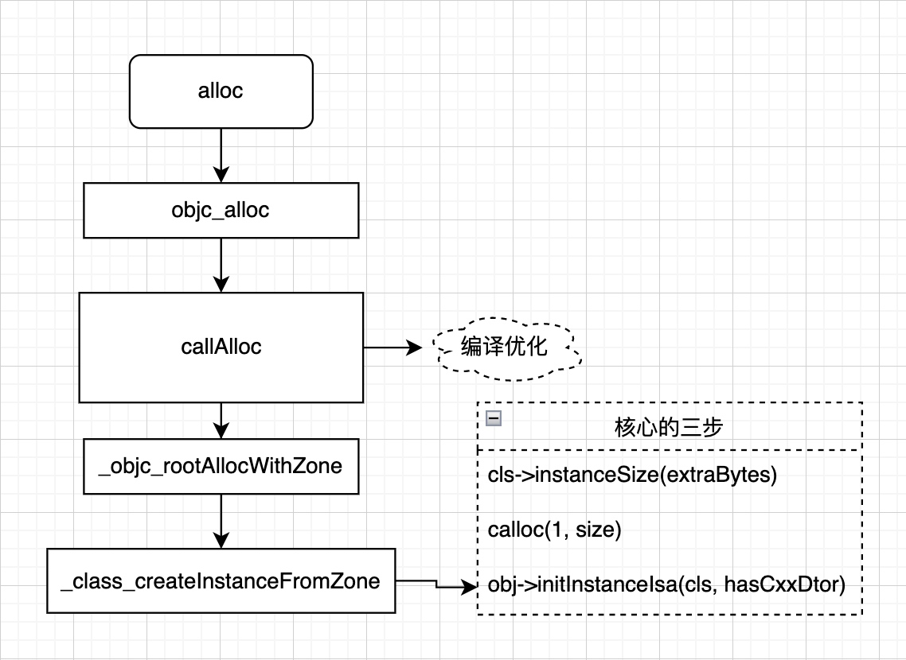
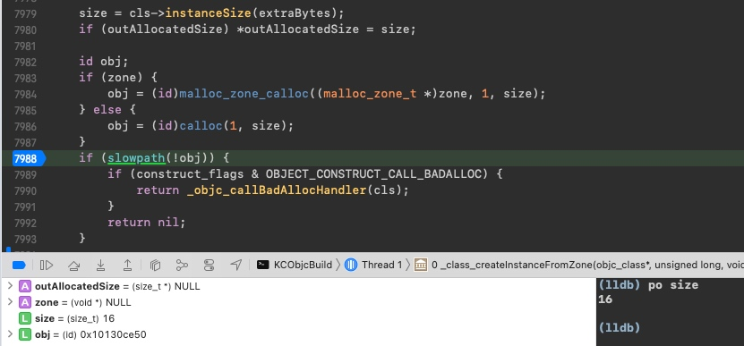
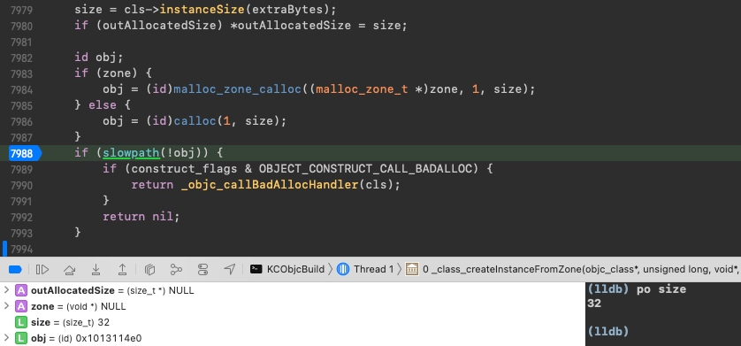
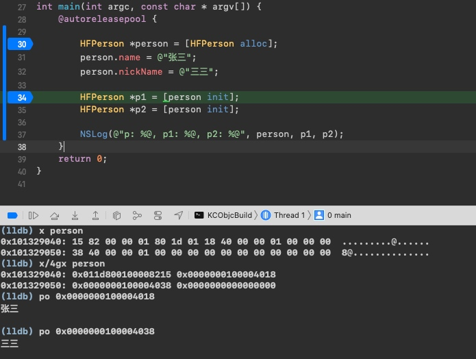
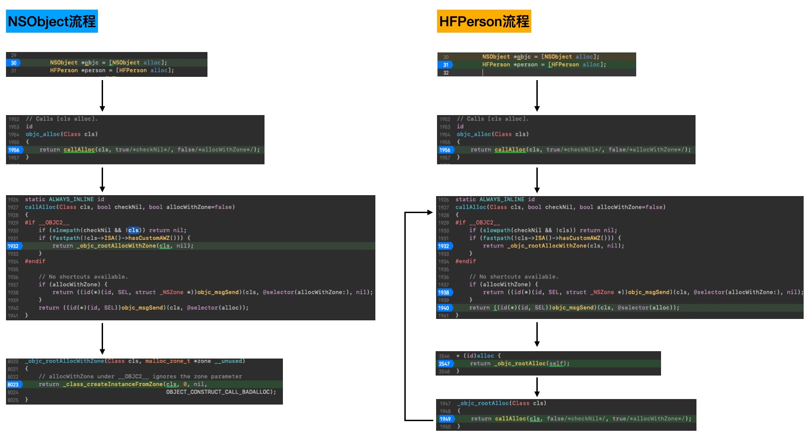
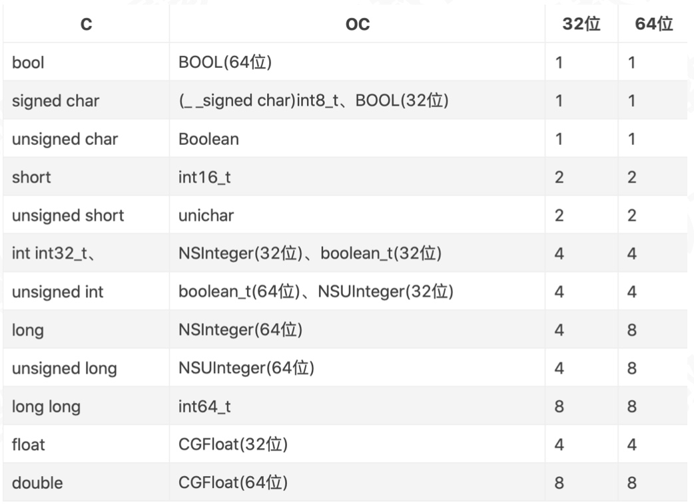
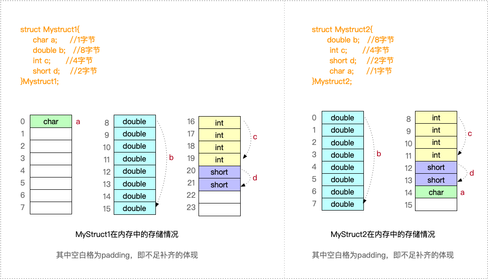
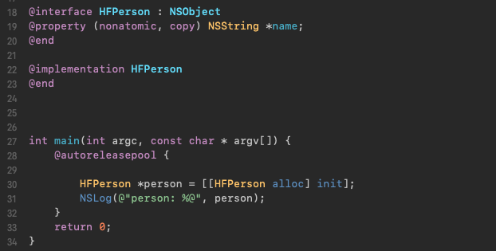
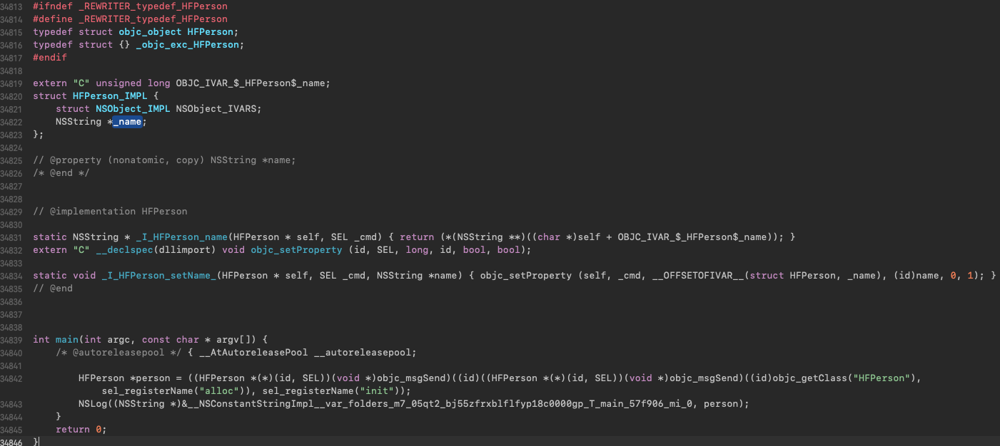

# 对象
### 初始化过程
#### alloc方法
```objc
int main(int argc, const char * argv[]) {
    @autoreleasepool {

        HFPerson *p = [HFPerson alloc];
        HFPerson *p1 = [p init];
        HFPerson *p2 = [p init];
        
        NSLog(@"p: %@, p1: %@, p2: %@", p, p1, p2);
    }
    return 0;
}
打印：
p: <HFPerson: 0x10070db90>, p1: <HFPerson: 0x10070db90>, p2: <HFPerson: 0x10070db90>
```




##### 1. objc_alloc
```c++
// Calls [cls alloc].
id objc_alloc(Class cls) {
=>    return callAlloc(cls, true/*checkNil*/, false/*allocWithZone*/);
}
```
##### 2. callAlloc
```c++
// Call [cls alloc] or [cls allocWithZone:nil], with appropriate
// shortcutting optimizations.

// cooci 2021.01.05
// KC 重磅提示 这里是核心方法
static ALWAYS_INLINE id
callAlloc(Class cls, bool checkNil, bool allocWithZone=false)
{
#if __OBJC2__
    if (slowpath(checkNil && !cls)) return nil;
    if (fastpath(!cls->ISA()->hasCustomAWZ())) {
    =>    return _objc_rootAllocWithZone(cls, nil);
    }
#endif

    // No shortcuts available.
    if (allocWithZone) {
        return ((id(*)(id, SEL, struct _NSZone *))objc_msgSend)(cls, @selector(allocWithZone:), nil);
    }
    return ((id(*)(id, SEL))objc_msgSend)(cls, @selector(alloc));
}
```
`hasCustomAWZ()`：判断当前类是否重写了allocWithZone方法。</br>
`fastpath(x)`和`slowpath(x)`是用于编译器优化的两个宏定义。
```c++
//fastpath(x)表示x很可能为true，大概率会执行
#define fastpath(x) (__builtin_expect(bool(x), 1))
//slowpath(x)表示x很可能为false，大概率不执行。
#define slowpath(x) (__builtin_expect(bool(x), 0))
```
通过这两个指令，编译器在编译过程中，会将可能性更大的代码紧跟着前面的代码，从而减少代码读取时指令跳转带来的性能上的下降。</br>
`callAlloc`方法里主要判断当前类是否有重写`allocWithZone`方法，如果有，就调用`allocWithZone`，若没有，就调用`objc_rootAllocWithZone`。因此，如果存在单例类，就需要重写`allocWithZone`，确保实例化的一定是单例对象。

##### 3. _objc_rootAllocWithZone
```c++
id _objc_rootAllocWithZone(Class cls, malloc_zone_t *zone __unused)
{
    // allocWithZone under __OBJC2__ ignores the zone parameter
    return _class_createInstanceFromZone(cls, 0, nil,
                                         OBJECT_CONSTRUCT_CALL_BADALLOC);
}
```

##### 4. _class_createInstanceFromZone
```c++
static ALWAYS_INLINE id
_class_createInstanceFromZone(Class cls, size_t extraBytes, void *zone,
                              int construct_flags = OBJECT_CONSTRUCT_NONE,
                              bool cxxConstruct = true,
                              size_t *outAllocatedSize = nil)
{
    ASSERT(cls->isRealized());

    // Read class's info bits all at once for performance
    bool hasCxxCtor = cxxConstruct && cls->hasCxxCtor();
    bool hasCxxDtor = cls->hasCxxDtor();
    bool fast = cls->canAllocNonpointer();
    size_t size;
    
    // 1.计算需要申请的内存空间大小
    size = cls->instanceSize(extraBytes);
    if (outAllocatedSize) *outAllocatedSize = size;

    // 2.为对象分配内存空间，并返回内存地址
    id obj;
    if (zone) {
        obj = (id)malloc_zone_calloc((malloc_zone_t *)zone, 1, size);
    } else {
        // zone一般为nil，所以会在这里开辟内存
        obj = (id)calloc(1, size);
    }
    
    // 此刻如果打印 obj，会发现:
    // 0x000000010135f910 仅仅只是一个地址，和传入的 cls 暂时没有任何关系
    if (slowpath(!obj)) {
        if (construct_flags & OBJECT_CONSTRUCT_CALL_BADALLOC) {
            return _objc_callBadAllocHandler(cls);
        }
        return nil;
    }
    
    // 3.将类和开辟的内存空间关联起来, 初始化实例的isa_t isa指针
    if (!zone && fast) {
    =>    obj->initInstanceIsa(cls, hasCxxDtor);
    } else {
        // Use raw pointer isa on the assumption that they might be
        // doing something weird with the zone or RR.
        obj->initIsa(cls);
    }

    if (fastpath(!hasCxxCtor)) {
        return obj;
    }

    construct_flags |= OBJECT_CONSTRUCT_FREE_ONFAILURE;
    return object_cxxConstructFromClass(obj, cls, construct_flags);
}
```
`hasCxxCtor()`：当前class或者superclass是否有.cxx_construct 构造方法的实现。</br>
`hasCxxDtor()`：该对象是否有 C++ 或者 Objc 的析构器，如果有析构函数，则需要做析构逻辑，如果没有，  则可以更快的释放对象。</br>
`canAllocNonpointer()`：表示是否对 isa 指针开启指针优化。0：纯isa指针；1：不⽌是类对象地址，isa 中还包含了类信息、对象的引⽤计数等。</br>
`zone`：在iOS8之后，iOS就不再通过zone来申请内存空间了，所以zone传参为nil。</br>

###### 计算所需内存大小的具体实现：
`cls->instanceSize(extraBytes)`是进行内存对齐得到的实例大小，里面的流程分别如下：
```c++
size_t instanceSize(size_t extraBytes) {
    size_t size = alignedInstanceSize() + extraBytes;
    // CF requires all objects be at least 16 bytes.
    if (size < 16) size = 16;
    return size;
}
    
uint32_t alignedInstanceSize() {
    return word_align(unalignedInstanceSize());
}
    
uint32_t unalignedInstanceSize() {
    assert(isRealized());
    return data()->ro->instanceSize;
}
    
// 字节对齐 - 旧版写法: 8的倍数
static inline uint32_t word_align(uint32_t x) {
    return (x + WORD_MASK) & ~WORD_MASK;
}

// 字节对齐 - 新写法: 16的倍数
static inline size_t align16(size_t x) {
    return (x + size_t(15)) & ~size_t(15);
}


#ifdef __LP64__
#   define WORD_MASK 7UL
#else
#   define WORD_MASK 3UL
#endif
```

###### 申请内存，并返回内存地址
```c
obj = (id)calloc(1, size);
```
分析`calloc`得深入到`libmalloc`源码，其中核心的地方在于验证了现在的iOS内存对齐方式是以16字节对齐
```c
#define SHIFT_NANO_QUANTUM      4
#define NANO_REGIME_QUANTA_SIZE (1 << SHIFT_NANO_QUANTUM)   // 16

static MALLOC_INLINE size_t
segregated_size_to_fit(nanozone_t *nanozone, size_t size, size_t *pKey)
{
    size_t k, slot_bytes;
    //k + 15 >> 4 << 4 --- 右移 + 左移 -- 后4位抹零，类似于16的倍数，跟 k/16 * 16一样
    //---16字节对齐算法，小于16就成0了
    if (0 == size) {
        size = NANO_REGIME_QUANTA_SIZE; // Historical behavior
    }
    k = (size + NANO_REGIME_QUANTA_SIZE - 1) >> SHIFT_NANO_QUANTUM; // round up and shift for number of quanta
    slot_bytes = k << SHIFT_NANO_QUANTUM;                           // multiply by power of two quanta size
    *pKey = k - 1;                                                  // Zero-based!

    return slot_bytes;
}
```
如果再尝试打印**对象指针**的话，会发现所有对象内存地址的后四位都是 0，因为objc初始化内存时是以16字节对齐的

###### 初始化`isa_t isa`的具体实现:
```c++
inline void 
objc_object::initIsa(Class cls, bool nonpointer, UNUSED_WITHOUT_INDEXED_ISA_AND_DTOR_BIT bool hasCxxDtor)
{ 
    ASSERT(!isTaggedPointer()); 
    
    isa_t newisa(0);

    if (!nonpointer) {
        newisa.setClass(cls, this);
    } else {
        ASSERT(!DisableNonpointerIsa);
        ASSERT(!cls->instancesRequireRawIsa());

        newisa.bits = ISA_MAGIC_VALUE; 
        // isa.magic is part of ISA_MAGIC_VALUE 表示 当前对象不再只是一个内存空间，已经被初始化。
        // isa.nonpointer is part of ISA_MAGIC_VALUE：表示 newisa 不止包含了类对象地址，还包含了是否有析构函数、对象的引⽤计数等其他信息。
#   if ISA_HAS_CXX_DTOR_BIT
        newisa.has_cxx_dtor = hasCxxDtor;
#   endif
        newisa.setClass(cls, this);
#endif
        newisa.extra_rc = 1;
    }

    isa = newisa;
}

inline void
isa_t::setClass(Class newCls, UNUSED_WITHOUT_PTRAUTH objc_object *obj)
{
    // 删掉相关环境判断条件，最终只执行这一句
    // 将类对象地址右移3位，然后赋值给 shiftcls 成员。
    shiftcls = (uintptr_t)newCls >> 3;
}
```
* `shiftcls = (uintptr_t)newCls >> 3;` 建立了**实例对象**与**类**之间的关系
* 为什么要强转成uintptr_t类型？</br>
uintptr_t是unsigned long类型，由于机器只能识别0 、1这两种数字，即二进制数据，所以将地址存储在内存空间时需要先转换为uintptr_t类型。
* 为什么要右移3位？</br>
用于将 Class 指针中无用的后三位清楚减小内存的消耗，因为类的指针要按照字节（8 bytes）对齐内存，其指针后三位都是没有意义的 0。

##### alloc总结
一般在这里就完成了对象的实例化，主要经过了三个步骤：
* `cls->instanceSize`：计算需要申请的内存空间大小，最少16字节。
* `calloc`：为对象分配内存空间，并返回内存地址。
* `initInstanceIsa`：初始化`isa_t isa`(其中包含 否有析构函数、对象的引⽤计数等其他信息)，通过它将当前类和开辟的内存空间关联起来。

#### init方法
```c++
- (id)init {
    return _objc_rootInit(self);
}

id _objc_rootInit(id obj)
{
    // In practice, it will be hard to rely on this function.
    // Many classes do not properly chain -init calls.
    return obj;
}
```
`init`方法其实没作其他处理，直接返回对象自身。</br>
系统采用工厂设计模式提供了一个构造方法，让开发者重写`init`作相关初始化操作。

#### new方法
```c++
+ (id)new {
    return [callAlloc(self, false/*checkNil*/) init];
}
```
`[NSObject new]`方法等同于`[[NSObject alloc] init]`，先调用`callAlloc`方法，再调用`init`方法。这两者的区别在于，采用`[alloc init]`方式可以灵活拓展，比如实现`initWithXXX`这种自定义的`init`方法，而采用`new`方式只能重写父类的`init`方法。

### 对象开辟内存的影响因素
#### 当 HFPerson 类中有1个属性 name 时
.h
```objc
@interface HFPerson : NSObject
@property (nonatomic, copy) NSString *name;
//@property (nonatomic, copy) NSString *nickName;
@end
```
打印size为16




#### 当 HFPerson 类中有2个属性 name, nickName 时
.h
```objc
@interface HFPerson : NSObject
@property (nonatomic, copy) NSString *name;
@property (nonatomic, copy) NSString *nickName;
@end
```
打印size为32


#### 分析 person 实例对象的内存结构


### NSObject 和 HFPerson 调用 alloc 流程

#### 1. 为什么我们调用的是 alloc 方法，到底层却是调的 objc_alloc?
LLVM 对 alloc 的特殊修饰 => 任何调用 alloc方法 都会被替换成调用 objc_alloc。
#### 2. 对于 HFPerson 类为什么会走两次 callAlloc 方法?


### 内存对齐
>每个特定平台上的编译器都有自己的默认“对齐系数”(也叫对齐模数)。程序员可以通过预编译命令#pragma pack(n)，n=1,2,4,8,16来改变这一系数，其中的n就是你要指定的“对齐系数”。在ios中，Xcode默认为#pragma pack(8)，即8字节对齐




#### 规则:
* **数据成员对齐规则:** struct 或者 union 的数据成员，第一个数据成员放在offset为0的地方，以后每个数据成员存储的起始位置要从该成员大小或者成员的子成员大小（只要该成员有子成员，比如数据、结构体等）的整数倍开始（例如int在32位机中是4字节，则要从4的整数倍地址开始存储）
* **数据成员为结构体:** 如果一个结构里有某些结构体成员，则结构体成员要从其内部最大元素大小的整数倍地址开始存储（例如：struct a里面存有struct b，b里面有char、int、double等元素，则b应该从8的整数倍开始存储）
* **结构体的整体对齐规则:** 结构体的总大小，即sizeof的结果，必须是其内部最大成员的整数倍，不足的要补齐

#### 获取内存大小的三种方式:
* `sizeof:` 操作符，传入`数据类型`，在编译阶段就可以得到该类型占用的空间大小
* `class_getInstanceSize:` 获取类的实例对象所占用的内存大小，其本质是获取实例对象中成员变量的内存大小
* `malloc_size:` 获取系统实际分配的内存大小

#### 实例：
```c
struct Mystruct1{
    char a;     //1字节
    double b;   //8字节
    int c;      //4字节
    short d;    //2字节
} Mystruct1;

struct Mystruct2{
    double b;   //8字节
    int c;      //4字节
    short d;    //2字节
    char a;     //1字节
} Mystruct2;
```



#### 内存优化
对比上述`Mystruct1` 和 `Mystruct2`发现：`Mystruct1`需要补齐 9 个字节，`Mystruct2`只需补齐 1 个字节，可以看出：结构体的内存大小与成员的排列顺序有关。</br>
* 大部分的内存都是通过固定的内存块进行读取
* 尽管我们在内存中采用了**内存对齐**的方式，但并不是所有的内存都可以进行浪费的，苹果会自动**对属性进行重排**，以此来优化内存

#### 字节对齐到底才用多少字节对齐？
前面我们提到iOS中，xcode的默认对齐系数是**8字节**对齐，具体场景：</br>
1. class_getInstanceSize，查看其源码可发现它是以 8字节 对齐
2. malloc_size，其源码以 16字节 对齐

#### 内存对齐算法
从源码看，目前已知的有两种：
```c
1.
static inline size_t align16(size_t x) {
    return (x + size_t(15)) & ~size_t(15);
}

2.
static MALLOC_INLINE size_t
segregated_size_to_fit(nanozone_t *nanozone, size_t size, size_t *pKey)
{
    size_t k, slot_bytes;
    //k + 15 >> 4 << 4 --- 右移 + 左移 -- 后4位抹零，类似于16的倍数，跟 k/16 * 16一样
    //---16字节对齐算法，小于16就成0了
    if (0 == size) {
        size = NANO_REGIME_QUANTA_SIZE; // Historical behavior
    }
    k = (size + NANO_REGIME_QUANTA_SIZE - 1) >> SHIFT_NANO_QUANTUM; // round up and shift for number of quanta
    slot_bytes = k << SHIFT_NANO_QUANTUM;                           // multiply by power of two quanta size
    *pKey = k - 1;                                                  // Zero-based!
    return slot_bytes;
}
```

### 本质
#### 准备知识
* `clang:` apple主导编写，基于`LLVM`的`C/C++/OC`的编译器
* `Objective-C`代码的底层实现都是`C/C++`代码，通过这个过程`Objective-C` ——> `C/C++` ——> `汇编语言` ——> `机器语言`转成机器能识别的语言
    * **.h** ：头文件。头文件包含类，类型，函数和常数的声明。 
    * **.m** ：源代码文件。这是典型的源代码文件扩展名，可以包含Objective-C和C代码。 
    * **.mm** ：源代码文件。带有这种扩展名的源代码文件，除了可以包含Objective-C和C代码以外还可以包含C++代码。仅在你的Objective-C代码中确实需要使用C++类或者特性的时候才用这种扩展名
    * **.cpp**：只能编译C++ 

#### 将 `main.m` 转成 `main.cpp`
```
//1、将 main.m 编译成 main.cpp
clang -rewrite-objc main.m -o main.cpp

//2、将 ViewController.m 编译成  ViewController.cpp
clang -rewrite-objc -fobjc-arc -fobjc-runtime=ios-13.0.0 -isysroot / /Applications/Xcode.app/Contents/Developer/Platforms/iPhoneSimulator.platform/Developer/SDKs/iPhoneSimulator13.7.sdk ViewController.m

//以下两种方式是通过指定架构模式的命令行，使用xcode工具 xcrun
//3、模拟器文件编译
- xcrun -sdk iphonesimulator clang -arch arm64 -rewrite-objc main.m -o main-arm64.cpp 

//4、真机文件编译
- xcrun -sdk iphoneos clang -arch arm64 -rewrite-objc main.m -o main- arm64.cpp 
```

#### NSObject 在 C++ 中的结构:
##### NSObject_IMPL
```c++
struct NSObject_IMPL {
	Class isa;
};
其中
Class：typedef struct objc_class *Class，可发现 isa 是指向 结构体 的指针
```
声明一个OCStudent类:
```objc
@interface OCStudent : NSObject
{
    @public
    NSString *_name;
    int _age;
}
@end
```
对应 C++ 中的结构：
```c++
struct OCStudent_IMPL {
	struct NSObject_IMPL NSObject_IVARS;
	NSString *_name;
	int _age;
};
```



##### `objc_setProperty()`
涉及 **适配器设计模式**

#### objc_object { isa_t isa; }
在`arm64`架构之前，`isa`就是一个普通的指针，存着`Class`，`Meta-Class`对象的内存地址</br>
在`arm64`架构之后，对`isa`进行了优化，变成了下面这种`union`共用体结构，还是用`位域`存储着更多的信息，如 是否优化过，是否有关联对象，Class对象指针等等，具体如下所示:
```c
struct objc_object {
    isa_t isa;
}

union isa_t {
    // 因为是存在于共同体中，所以 bits / cls 是互斥的
    uintptr_t bits;
    Class cls; 
    
    struct {
        uintptr_t nonpointer        : 1;  // 是否优化过，使用位域存储更多的信息                                       
        uintptr_t has_assoc         : 1;  // 是否设置过关联对象                                   
        uintptr_t has_cxx_dtor      : 1;  // 是否有C++的析构函数，如果没有，释放更快                                     
        uintptr_t shiftcls          : 33; // 存储着Class, Meta-Class对象的内存地址
        uintptr_t magic             : 6;  // 对象是否完成初始化                                     
        uintptr_t weakly_referenced : 1;  // 是否被弱引用指向过，如果没有，释放时更快                                     
        uintptr_t unused            : 1;  //                                      
        uintptr_t has_sidetable_rc  : 1;  // 引用计数是否过大无法存储在isa中，如果为1，那么引用计数会存在一个叫 SideTable 的类的属性中                                    
        uintptr_t extra_rc          : 19  // 存的值 = 引用计数 - 1
    };
};
```
通过前面的分析得知，实例对象的`isa`是在`_class_createInstanceFromZone`中的第三个核心方法`obj->initInstanceIsa(cls, hasCxxDtor);`与`类(cls)`关联起来

#### 结论
OC对象的本质其实就是**结构体**


