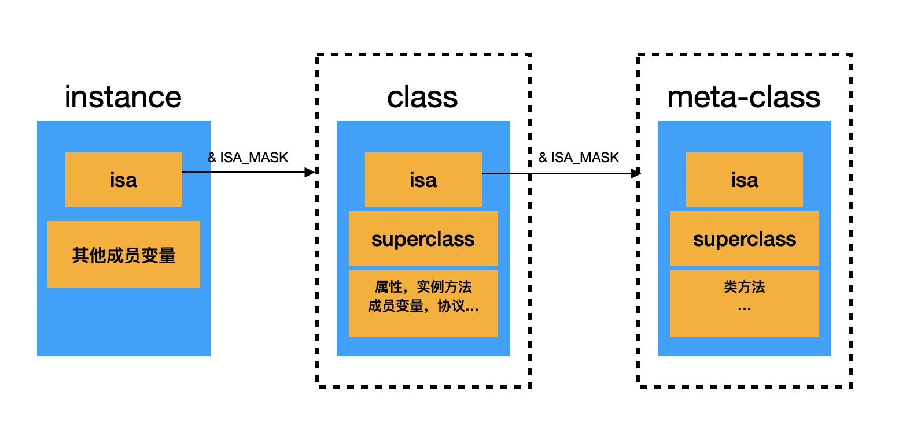
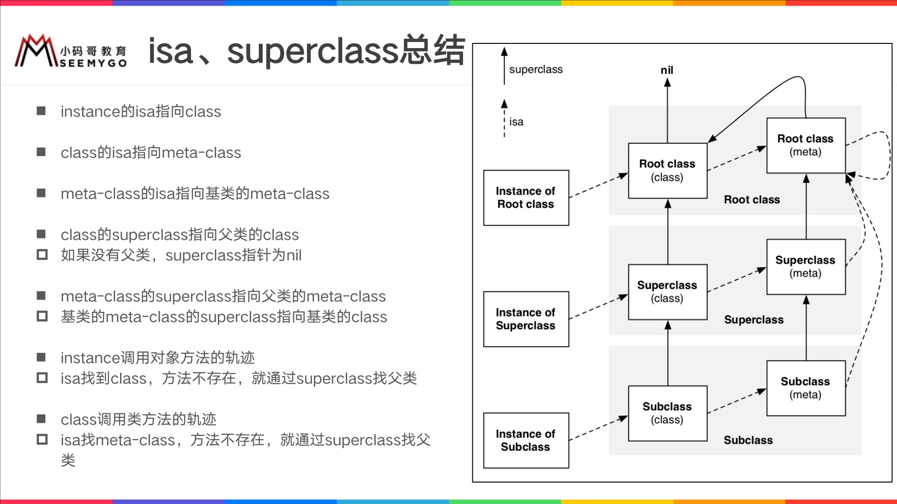
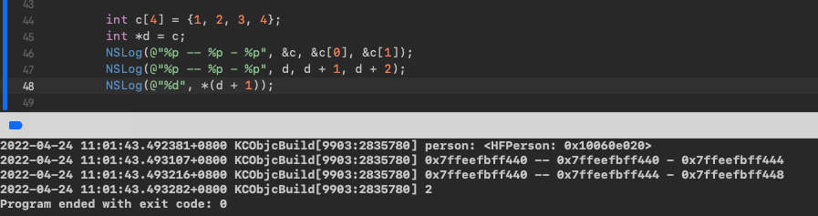
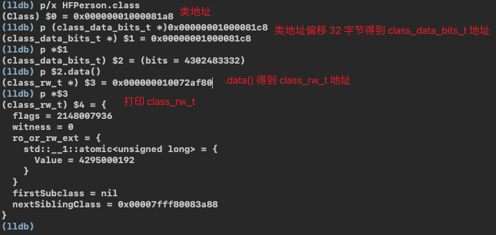
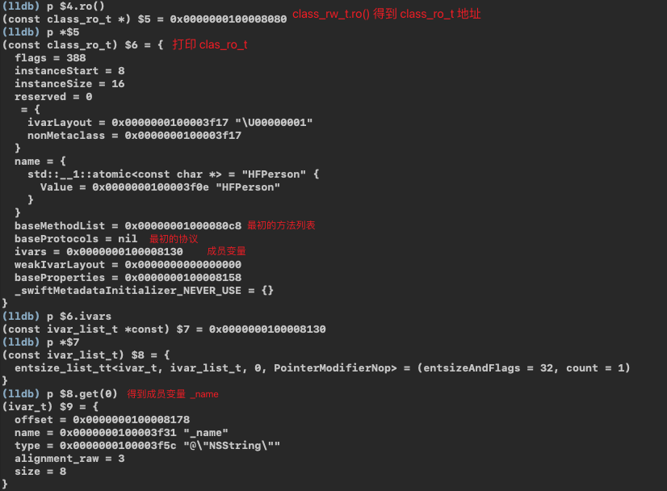

# 类
> 前面通过**OC - 对象**我们得知，在**对象**的初始化过程中建立了与其**class**的联系，下面就是关于**类**的分析

### Overview



### 底层结构

定义一个 HFPerson 类
```objc
@interface HFPerson : NSObject
@property (nonatomic, copy) NSString *name;

- (void)sayHello;
@end

@implementation HFPerson
- (void)sayHello {
    NSLog(@"HFPerson -sayHello");
}
@end
```
#### objc_class
```c++
struct objc_class : objc_object {
    Class isa;
    Class superclass;
    
    cache_t cache;
    class_data_bits_t bits;
}
```

#### class_rw_t 结构
存放类中的`属性`、`方法`和`遵循的协议`等信息
```c++
struct class_rw_t {
    uint32_t flags;
    uint32_t version;
    
    const class_ro_t *ro; 
    /*
     这三个都是二维数组，是可读可写的，包含了类的初始内容、分类的内容。
     其中 method_array_t 存放类似这种结构：[method_list_t<method_t>,
                                        method_list_t<method_t>,
                                        method_list_t<method_t>]
     */
    method_array_t methods; // 方法列表（类对象存放对象方法，元类对象存放类方法）
    property_array_t properties; // 属性列表
    protocol_array_t protocols; //协议列表
}
```

#### class_ro_t 结构
存放类的初始信息
```c++
struct class_ro_t {
    uint32_t flags;
    uint32_t instanceStart;
    uint32_t instanceSize;
    uint32_t reserved;

    const uint8_t * ivarLayout;

    const char * name;
    /* 这三个都是一维数组 */
    method_list_t * baseMethodList; // 初始方法，存放method_t类型的数据
    protocol_list_t * baseProtocols; // 初始协议
    const ivar_list_t * ivars; // 成员变量

    const uint8_t * weakIvarLayout;
    property_list_t *baseProperties;
}
```

### 验证
#### 内存偏移


`&c`，`&c[0]`和`d` 都是取的**数组首地址**<br>
`d + 1`是以**该数组的内部数据类型所占的内存大小为单位，偏移 1 个单位**

#### 验证 class_rw_t
```c
struct objc_class : objc_object {
    ...
    class_rw_t *data() const {
        return bits.data();
    }
}
```


#### 验证 class_ro_t
```c
struct class_rw_t {
    ...
    const class_ro_t *ro() const {
        auto v = get_ro_or_rwe();
        if (slowpath(v.is<class_rw_ext_t *>())) {
            return v.get<class_rw_ext_t *>(&ro_or_rw_ext)->ro;
        }
        return v.get<const class_ro_t *>(&ro_or_rw_ext);
    }
}
```



### class方法，object_getClass 和 objc_getClass 三者的区别
####  `class`方法

`class`方法无论是类对象还是实例对象都可以调用，可以嵌套，返回永远是自身的类对象。如：
```swift
Person *p = [[Person alloc]init];
Class *pClass == [p class] == [ [p class]class] == [[ [p class]class]class] == [Person class]
```

####  `object_getClass`方法

`object_getClass`和`class`同样可以嵌套，但是`object_getClass`得到的是他的 isa 指向的地址。如：
```swift
Person *p = [[Person alloc] init];     
p -> [Person class] -> PersonMetaClass -> RootMetaClass -> RootMetaClass
// 意思是： p 的 isa 指向 [Person class] , [Person class] 的 isa 指向 PersonMetaClass, PersonMetaClass应该指向基类的metaClass，基类metaClass指向他自己
```

####  `objc_getClass`方法

`objc_getClass`无法嵌套，因为参数 是`char`类型，效果和`class`相同(因为不能嵌套，所以和`class`可以认为是相同的)