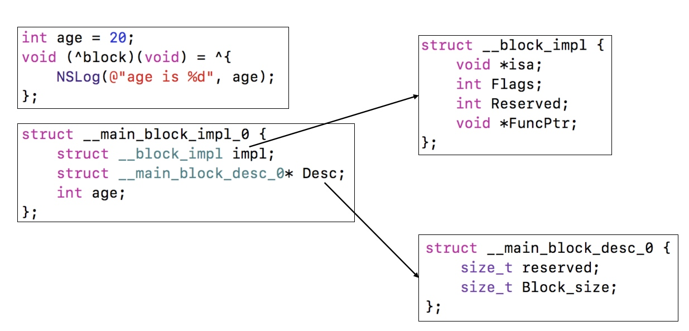
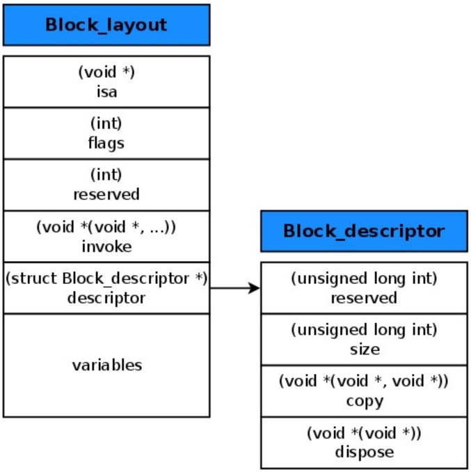
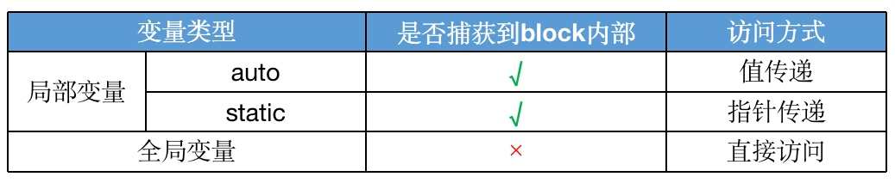
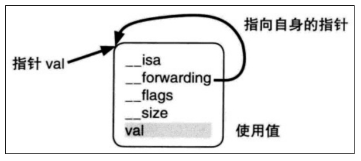
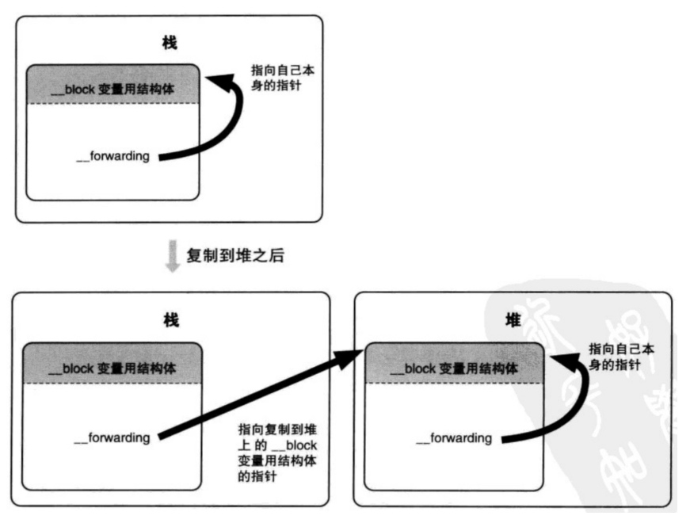

# block

### 基本介绍
block 可以认为是一种匿名函数，使用如下语法声明一个 block 类型：
```objc
return_type (^block_name)(parameters)
```
例如：
```objc
int (^multiplyTwoValues)(int, int);
```
block 字面值的写法如下：
```objc
^ (int firstValue, int secondValue) {
    return firstValue * secondValue;
}
```
实际开发中，常用typedef定义Block
```objc
typedef return_type (^block_name)(parameters);
```

### 本质
block本质上也是一个OC对象，它内部也有个isa指针, 它是封装了函数调用以及函数调用环境的OC对象。

#### 底层数据结构

#### 编译后的C++代码
```c++
struct __main_block_impl_0 {
  struct __block_impl impl;
  struct __main_block_desc_0* Desc;
  
  // 构造函数
  __main_block_impl_0(void *fp, struct __main_block_desc_0 *desc, int flags=0) {
    impl.isa = &_NSConcreteStackBlock;
    impl.Flags = flags;
    impl.FuncPtr = fp;
    Desc = desc;
  }
};

struct __block_impl {
  void *isa;
  int Flags;
  int Reserved;
  void *FuncPtr;
};

struct __main_block_desc_0 {
  size_t reserved;
  size_t Block_size;
  
  // 当block捕获到的变量需要做内存管理时(是一个对象)，才会生成下面这两个函数
  void (*copy)(struct __main_block_impl_0*, struct __main_block_impl_0*); // 栈上的block复制到堆时
  void (*dispose)(struct __main_block_impl_0*); // 堆上的block被废弃时
};
```

### 变量捕获（capture）

* 只有局部变量才需要捕获（也容易理解，因为全局变量随处可以访问，不需要额外捕获到block内部）
* 局部变量根据其修饰的关键字不同(eg: auto, static)，捕获的方式不同（可以这么理解：auto修饰的变量离开作用域就销毁，static修饰的变量，生命周期变长了，为了还能使用它的值，所以采用指针传递的方式）


### 类型

| 类型 | 环境 | 位置 |
|:-:|:-:|:-:|
|__NSGlobalBlock__ | 没有访问auto变量 | 数据区域.data区 |
| __NSStackBlock__ | 访问了auto变量 | 栈(stack) |
| __NSMallocBlock__ | __NSStackBlock__调用了copy | 堆(heap) |

#### 每种类型的block调用copy后的结果如下
| 类型 | 副本源的配置存储域 | 复制效果 |
|:-:|:-:|:-:|
|__NSGlobalBlock__ | 数据区域.data区 | 什么也不做 |
| __NSStackBlock__ | 栈 | 从`栈`复制到`堆` |
| __NSMallocBlock__ | 堆 | 引用计数增加 |

### block的copy
>在ARC开启的情况下，将只会有`NSConcreteGlobalBlock`和`NSConcreteMallocBlock`类型的block，因为`编译器`会根据情况自动将`栈`上的`block`复制到`堆`上（这样做也能理解：因为如果block在`栈`上，它的生命周期有系统管理，无法控制，复制到`堆`上的话，更方便管理）。

#### 栈上的 block 复制到堆上，比如以下情况
##### 1. block作为函数返回值时：
```objc
typedef void (^MyBlock)(void);

MyBlock setBlock() {
    int a = 2;
    MyBlock block = ^{
        NSLog(@"a is %d", a);
    };
    return block;
}

int main(int argc, const char * argv[]) {
    @autoreleasepool {
        
        MyBlock block = setBlock();
        // 打印 block 的类型，会发现是 __NSMallocBlock__
        block();
    }
    return 0;
}
```
##### 2. 将block赋值给__strong指针时：
```objc
int main(int argc, const char * argv[]) {
    @autoreleasepool {
        
        int a = 2;
        MyBlock block = ^{
            NSLog(@"a is %d", a);
        };
        // 打印 block 的类型，会发现是 __NSMallocBlock__
        block();
    }
    return 0;
}
```
##### 3. block作为Cocoa API中方法名含有usingBlock的方法参数时：
```objc
int main(int argc, const char * argv[]) {
    @autoreleasepool {
        
        NSArray *arr = @[@1, @2, @3];
        
        [arr enumerateObjectsUsingBlock:^(id  _Nonnull obj, NSUInteger idx, BOOL * _Nonnull stop) {
            NSLog(@"~~~~%d", [obj intValue]);
        }];
    }
    return 0;
}
```
##### 4. block作为GCD API的方法参数时：
```objc
int main(int argc, const char * argv[]) {
    @autoreleasepool {
        
        static dispatch_once_t onceToken;
        dispatch_once(&onceToken, ^{
            
        });
    }
    return 0;
}
```

#### 当block内部访问了对象类型的auto变量时
##### 如果`block`在`栈(stack)`上
* 那么它不会对捕获的变量产生强引用（很容易理解，因为block本身都在`栈`上，它自己都不知道自己什么时候被销毁，肯定也没必要强引用捕获的变量了）
##### 如果`block`被拷贝到`堆(heap)`上
* 会调用`block`内部的`copy`函数
* `copy`函数内部会调用`_Block_object_assign`函数
* `_Block_object_assign`函数会根据auto变量的修饰符（`__strong`、`__weak`、`__unsafe_unretained`）做出相应的操作，形成`强引用（retain）`或者`弱引用`
##### 如果`block`从`堆(heap)`上移除:
* 会调用`block`内部的`dispose`函数
* `dispose`函数内部会调用`_Block_object_dispose`函数
* `_Block_object_dispose`函数会自动释放引用的auto变量`（release）`

### __block
```objc
typedef void (^MyBlock)(void);

int main(int argc, const char * argv[]) {
    @autoreleasepool {
        
        int a = 1;
        MyBlock block = ^{
            a = 2; // 这行会报错
            NSLog(@"a is %d", a);
        };
        block();
    }
    return 0;
}
```
Q：为什么上面的`a = 2`会报错？

A：因为从本质上看，`a = 2`是放在`block`->`impl`->`FuncPtr`中，`int a = 1;`是声明在`main`函数中，跨函数调用一个局部变量，肯定是不可行的。

所以，这就有了我们的`__block`关键字

#### 作用：
* `__block`可以用于解决`block`内部无法修改`auto`变量值的问题
* `__block`不能修饰全局变量，静态变量(static)
#### 本质：
编译器会将`__block`修饰的变量包装成一个`对象`
```c++
// __block int a 对应的结构
struct __Block_byref_a_0 {
  void *__isa;
__Block_byref_a_0 *__forwarding;
 int __flags;
 int __size;
 int a;
};

// __block HFPerson *person 对应的结构
struct __Block_byref_person_1 {
  void *__isa;
__Block_byref_person_1 *__forwarding;
 int __flags;
 int __size;
 // 因为HFPerson是一个对象，所以对应会生成两个用于内存管理的函数
 void (*__Block_byref_id_object_copy)(void*, void*);
 void (*__Block_byref_id_object_dispose)(void*);
 HFPerson *person;
};
```


#### 内存管理：
##### 当block在栈上时
并不会对`__block`修饰的变量产生强引用

##### 当block被copy到堆时
* 会调用block内部的copy函数
* copy函数内部会调用_Block_object_assign函数
* _Block_object_assign函数会对__block变量形成强引用（retain）

##### 当block从堆中移除时
* 会调用block内部的dispose函数
* dispose函数内部会调用_Block_object_dispose函数
* _Block_object_dispose函数会自动释放引用的__block变量（release）

#### __forwarding指针


#### 

### 面试
#### block什么情况下会循环引用
当造成引用闭环的时候，会造成循环引用。

根本原因：在`堆heap`上的block会对块内强引用的对象进行引用计数+1

#### block的修饰符是什么？
ARC: `strong` 或者 `copy`

MRC: `copy`

因为block声明之后，一般在`栈`上或者`全局区`，但是为了能控制block的生命周期，我们得将block复制到`堆`上，所以得用copy，strong关键字也会有copy。