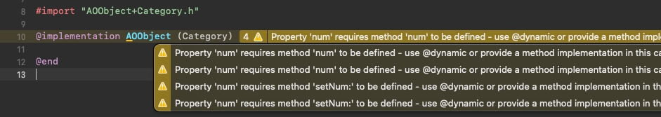
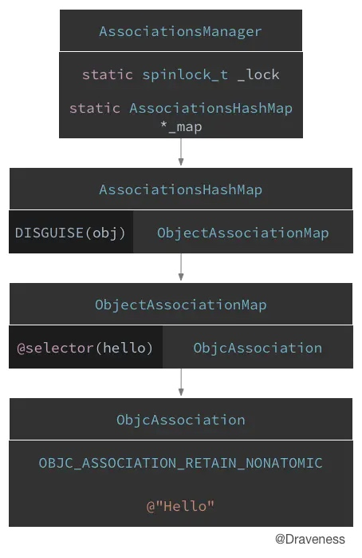

# 关联对象AssociatedObject
> 通过前面`Category`的学习我们知道：在`Category`中为类添加`@property`属性是不能正确创建成员变量和`setter/getter`方法的，会有如下提示:

.h文件
```objc
@interface AOObject (Category)
@property (nonatomic, copy) NSString *num;
@end
```
.m文件


为了解决这个问题，我们需要使用`关联对象AssociatedObject`为已经存在的类添加`伪属性`

### 基本介绍
```objc
#import "AOObject+Category.h"
#import <objc/runtime.h>

@implementation AOObject (Category)

- (void)setNum:(int)num {
    objc_setAssociatedObject(self, @selector(num), @(num), OBJC_ASSOCIATION_ASSIGN);
}

- (int)num {
    return [objc_getAssociatedObject(self, @selector(num)) intValue];
}
@end
```

这里有个问题:
#### 为什么向方法中传入 @selector(num)？
`@selector(num)` 也就是参数中的 key，其实可以使用静态指针`static void *`类型的参数来代替，不过在这里，强烈推荐使用`@selector(num)`作为`key`传入。因为这种方法省略了声明参数的代码，并且能很好地保证`key`的唯一性。</br>

**`@selector(...)`有以下[特性](https://draveness.me/message/):**
* Objective-C 为我们维护了一个巨大的选择子表
* 在使用 @selector() 时会从这个选择子表中根据选择子的名字查找对应的 SEL。如果没有找到，则会生成一个 SEL 并添加到表中
* 在编译期间会扫描全部的头文件和实现文件将其中的方法以及使用 @selector() 生成的选择子加入到选择子表中

### C++代码
```c++
static void _I_HFPerson_Test_setAge_(HFPerson * self, SEL _cmd, int age) {
    objc_setAssociatedObject(self, sel_registerName("num"), ((NSNumber *(*)(Class, SEL, int))(void *)objc_msgSend)(objc_getClass("NSNumber"), sel_registerName("numberWithInt:"), (int)(num)), OBJC_ASSOCIATION_ASSIGN);
}

static int _I_HFPerson_Test_age(HFPerson * self, SEL _cmd) {
    return ((int (*)(id, SEL))(void *)objc_msgSend)((id)objc_getAssociatedObject(self, sel_registerName("num")), sel_registerName("intValue"));
}
```


其中的`objc_setAssociatedObject(...)`函数，进一步会调用`_object_set_associative_reference(...)`
```c++
void _object_set_associative_reference(id object, void *key, id value, uintptr_t policy) {
    // retain the new value (if any) outside the lock.
    ObjcAssociation old_association(0, nil);
    id new_value = value ? acquireValue(value, policy) : nil;
    {
        AssociationsManager manager;
        AssociationsHashMap &associations(manager.associations());
        disguised_ptr_t disguised_object = DISGUISE(object);
        if (new_value) {
            // break any existing association.
            AssociationsHashMap::iterator i = associations.find(disguised_object);
            if (i != associations.end()) {
                // secondary table exists
                ObjectAssociationMap *refs = i->second;
                ObjectAssociationMap::iterator j = refs->find(key);
                if (j != refs->end()) {
                    old_association = j->second;
                    j->second = ObjcAssociation(policy, new_value);
                } else {
                    (*refs)[key] = ObjcAssociation(policy, new_value);
                }
            } else {
                // create the new association (first time).
                ObjectAssociationMap *refs = new ObjectAssociationMap;
                associations[disguised_object] = refs;
                (*refs)[key] = ObjcAssociation(policy, new_value);
                _class_setInstancesHaveAssociatedObjects(_object_getClass(object));
            }
        } else {
            // setting the association to nil breaks the association.
            AssociationsHashMap::iterator i = associations.find(disguised_object);
            if (i !=  associations.end()) {
                ObjectAssociationMap *refs = i->second;
                ObjectAssociationMap::iterator j = refs->find(key);
                if (j != refs->end()) {
                    old_association = j->second;
                    refs->erase(j);
                }
            }
        }
    }
    // release the old value (outside of the lock).
    if (old_association.hasValue()) ReleaseValue()(old_association);
}
```
我们可以看到所有的关联对象都由AssociationsManager管理，而AssociationsManager定义如下：
```c++
class AssociationsManager {
    static OSSpinLock _lock;
    static AssociationsHashMap *_map; // associative references:  object pointer -> PtrPtrHashMap.
    
public:
    // OSSpinLockLock保证了每次只会有一个线程对AssociationsHashMap进行操作
    AssociationsManager()   { OSSpinLockLock(&_lock); }
    ~AssociationsManager()  { OSSpinLockUnlock(&_lock); }
    
    AssociationsHashMap &associations() {
        if (_map == NULL)
            _map = new AssociationsHashMap();
        return *_map;
    }
}
```
AssociationsManager里面是由一个静态AssociationsHashMap来存储所有的关联对象的。这相当于把所有对象的关联对象都存在一个全局map里面。而map的的key是这个对象的指针地址（任意两个不同对象的指针地址一定是不同的），而这个map的value又是另外一个AssociationsHashMap，里面保存了关联对象的kv对。

而在对象的销毁逻辑里面，见objc-runtime-new.mm:
```c++
void *objc_destructInstance(id obj) 
{
    if (obj) {
        Class isa_gen = _object_getClass(obj);
        class_t *isa = newcls(isa_gen);

        // Read all of the flags at once for performance.
        bool cxx = hasCxxStructors(isa);
        bool assoc = !UseGC && _class_instancesHaveAssociatedObjects(isa_gen);

        // This order is important.
        if (cxx) object_cxxDestruct(obj);
        if (assoc) _object_remove_assocations(obj);
        
        if (!UseGC) objc_clear_deallocating(obj);
    }

    return obj;
}
```
嗯，`runtime`的销毁对象函数`objc_destructInstance`里面会判断这个对象有没有关联对象，如果有，会调用`_object_remove_assocations`做关联对象的清理工作。

### 实现总结：
关联对象又是如何实现并且管理的呢？
* 关联对象其实就是`ObjcAssociation`对象
* 关联对象由`AssociationsManager`管理并在`AssociationsHashMap`存储
* 对象的指针以及其对应`ObjectAssociationMap`以键值对的形式存储在`AssociationsHashMap`中
* `ObjectAssociationMap`则是用于存储关联对象的数据结构
* 每一个对象都有一个标记位`has_assoc`指示对象是否含有关联对象

### 图解



### 具体细节分析
参考draveness大神的[关联对象 AssociatedObject 完全解析](https://draveness.me/ao/)