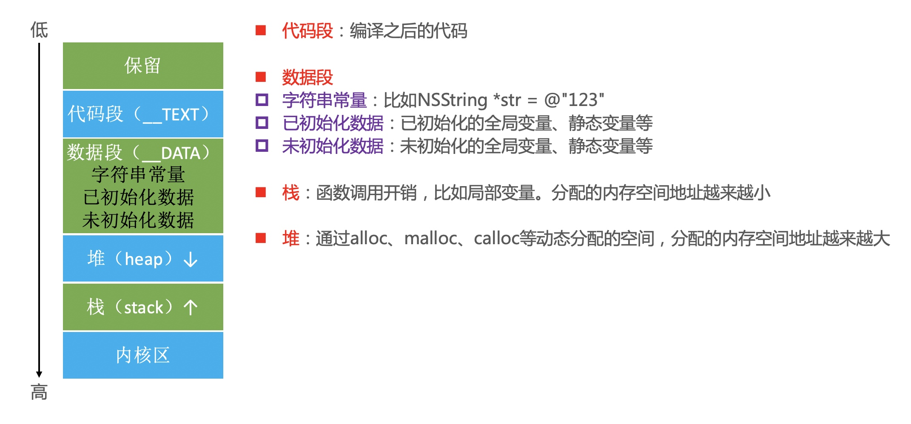

# 内存管理

### 内存布局


```objc
NSString *globalString = @"globalString";
int a = 1;
int b;

int main(int argc, char * argv[]) {
    @autoreleasepool {
        NSString *localString = @"localString";
        static int c;
        
        int d;
        int e = 2;
        
        NSObject *obj = [NSObject new];
        
        NSLog(@"globalString:%p\na: %p\nb: %p\nlocalString:%p\nc: %p\nd: %p\ne: %p\nobj: %p\n", globalString, &a, &b, localString, &c, &d, &e, obj);
        
        return UIApplicationMain(argc, argv, nil, NSStringFromClass([AppDelegate class]));
    }
}

打印:
globalString:   0x10e3a81d0
a:              0x10e3a9658
b:              0x10e3a9738
localString:    0x10e3a81f0
c:              0x10e3a9720
d:              0x7ffee1859ca4
e:              0x7ffee1859ca0
obj:            0x600000cf0000

排序（由低到高）后:
// 字符串常量，无论全局/局部
globalString:   0x10e3a81d0
localString:    0x10e3a81f0

// 已初始化的全局变量，静态变量等
a:              0x10e3a9658

// 未初始化的全局变量，静态变量等
c:              0x10e3a9720
b:              0x10e3a9738

// 堆
obj:            0x600000cf0000

// 栈
d:              0x7ffee1859ca4
e:              0x7ffee1859ca0
```

### Tagged Pointer

### MRC(manual reference count)
> 三个阶段
#### 1. 成员变量 + setter + getter
HFPerson.h
```objc
@interface HFPerson : NSObject
{
    HFDog *_dog;
}

- (void)setDog:(HFDog *)dog;
- (HFDog *)dog;
@end
```
HFPerson.m
```objc
@implementation HFPerson
- (void)setDog:(HFDog *)dog {
    if (_dog != dog) { // 例子三：开启“僵尸对象”，如果多次通过setter方法设置同一个dog对象，加上这个条件可以防止多次释放，也避免对同一对象重复赋值
        [_dog release]; // 例子二：多次通过setter方法设置dog对象，那么前一个对象得release
        _dog = [dog retain]; // 例子一：自己的对象自己持有，最终在dealloc方法中release一下
    }
    // 以上三行代码举例三个例子
}

- (HFDog *)dog {
    return _dog;
}
@end
```

#### 2. @property + @synthesize
`@property`做了两件事：
1. 声明`setter`方法
2. 声明`getter`方法
```objc
@property (nonatomic, retain) HFCar *car;
```
`@synthesize`做了三件事：
1. 生成属性`car`对应的成员变量为`_car`(名字可自定义)
2. 实现`setter`方法
3. 实现`getter`方法
```objc
@synthesize car = _car;
```

#### 3. @property
随着编译器的发展，现在的`@property`已经实现了上述所有功能：
1. 声明`setter`，`getter`方法
2. 生成`_`开头的成员变量
3. 实现`setter`，`getter`方法

### MRC开发体验
```objc
#import "ViewController.h"

@interface ViewController ()
@property (nonatomic, retain) NSMutableArray *data;
@end

@implementation ViewController

- (void)viewDidLoad {
    [super viewDidLoad];
    
    // 写法一：
    NSMutableArray *data = [[NSMutableArray alloc] init];
    self.data = data;
    [data release]; // alloc了一次，就得release一次
    
    // 写法二：
    self.data = [[[NSMutableArray alloc] init] autorelease];
    
    // 写法三：
    // array方法中包含了 autorelease 操作
    self.data = [NSMutableArray array];
}

- (void)dealloc {
    self.data = nil;
    [super dealloc];
}
```

### copy

### ARC下的引用计数存储

### weak指针
#### `__strong, __weak, __unsafe_unretained` 三者的区别:
* `__strong`: 会使__strong修饰的指针所指向的对象引用计数+1
* `__weak`: 不会使__weak修饰的指针所指向的对象引用计数+1，**并且在被修饰的对象释放后，该指针会置为`nil`**
* `__unsafe_unretained`: 不会使__weak修饰的指针所指向的对象引用计数+1


#### 实现原理
> 当一个对象要释放时，会自动调用`dealloc`，接下来的调用轨迹如下：
1. dealloc
2. _objc_rootDealloc
3. rootDealloc
4. object_dispose
5. objc_destructInstance、free

```c++
void objc_object::rootDealloc()
{
    if (isTaggedPointer()) return;  // fixme necessary?

    if (fastpath(isa.nonpointer                     &&
                 !isa.weakly_referenced             &&
                 !isa.has_assoc                     &&
#if ISA_HAS_CXX_DTOR_BIT
                 !isa.has_cxx_dtor                  &&
#else
                 !isa.getClass(false)->hasCxxDtor() &&
#endif
                 !isa.has_sidetable_rc))
    {
        assert(!sidetable_present());
        free(this);
    } 
    else {
        object_dispose((id)this);
    }
}
// 从上述代码可以看出：
// 如果isa的weakly_referenced，has_assoc，has_cxx_dtor...不存在，释放时会更快
```

```c++
void *objc_destructInstance(id obj) 
{
    if (obj) {
        // Read all of the flags at once for performance.
        bool cxx = obj->hasCxxDtor();
        bool assoc = obj->hasAssociatedObjects();

        // This order is important.
        if (cxx) object_cxxDestruct(obj); // 清除成员变量
        if (assoc) _object_remove_assocations(obj, /*deallocating*/true); // 移除关联对象
        obj->clearDeallocating(); // 将指向当前对象的弱指针置为nil
    }

    return obj;
}
```

### autorelease自动释放池
```objc
@autoreleasepool {
    NSObject *objc = [[[NSObject alloc] init] autorelease];
}
```
编译后的C++代码：
```c
struct __AtAutoreleasePool {
    __AtAutoreleasePool() { // 构造函数，在创建结构体的时候调用
        atautoreleasepoolobjc =objc_autoreleasePoolPush();
    }
    
    ~__AtAutoreleasePool() { // 析构函数，在结构体销毁的时候调用
        objc_autoreleasePoolPop(atautoreleasepoolobj);
    }
    
    void * atautoreleasepoolobj;
};

{
    __AtAutoreleasePool __atautoreleasepool;
    NSObject *objc = [[[NSObject alloc] init] autorelease];
}
```


### 听课笔记
* static变量和全局变量可以认为是一样的，内存中只有一份，它和全局变量放一起的，都是在数据段(_DATA)
* 只要是堆空间的对象，它的最低有效位为0，因为OC对象的内存对齐
* MRC环境下`set`方法和`get`方法
* @synthesize
* 我们会发现`mutableCopy`都是针对`Foundation`框架的这类数据(省略了前面的NS，NSMutable前缀)`Array`、`Dictionary`、`String`、`Data`、`Set`。
* 自定义对象的`Copy`的遵守`NSCoping`协议